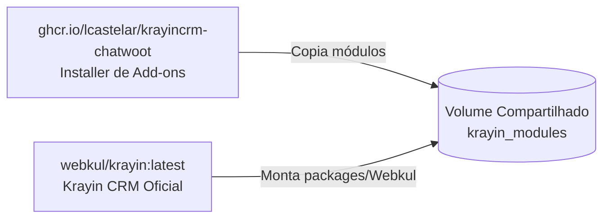

# Krayin CRM - Chatwoot Integration & Advanced Analytics Add-ons

[](https://github.com/lcastelar/krayincrm-chatwoot/actions/workflows/docker-build.yml)
[](https://github.com/lcastelar/krayincrm-chatwoot/pkgs/container/krayincrm-chatwoot)
[](https://opensource.org/licenses/MIT)

Este repositório contém os módulos e add-ons oficiais para o **[Krayin CRM](https://krayincrm.com)**:
- 💬 **`Webkul\Chatwoot`**: Dashboard App para atendentes no Chatwoot e sincronização bidirecional via Webhooks.
- 📊 **`Webkul\Reports`**: Painel avançado de Relatórios & Inteligência de Vendas (Visão Geral, Vendas & Receita, Funil Cônico, Desempenho por Tags e Produtividade da Equipe).

---

## 🏗️ Arquitetura dos Add-ons

Este repositório fornece uma imagem instaladora leve (`ghcr.io/lcastelar/krayincrm-chatwoot:latest`) que injeta os módulos diretamente na imagem oficial **`webkul/krayin:latest`** através de um volume compartilhado.



---

## 🚀 Como Usar no Portainer / Docker Compose

Adicione os serviços abaixo na sua stack do Portainer / Docker Compose. A aplicação principal roda com a imagem oficial do Krayin (`webkul/krayin:latest`) e os add-ons são carregados automaticamente:

```yaml
version: "3.7"
services:

  ## --------------------------- INSTALADOR DE ADDONS (GITHUB) --------------------------- ##

  krayin_addons_installer:
    image: ghcr.io/lcastelar/krayincrm-chatwoot:latest
    command: sh -c "mkdir -p /target/Chatwoot /target/Reports && cp -rf /modules/Webkul/Chatwoot/* /target/Chatwoot/ && cp -rf /modules/Webkul/Reports/* /target/Reports/"
    volumes:
      - krayin_modules:/target
    deploy:
      restart_policy:
        condition: on-failure
        max_attempts: 2

  ## --------------------------- KRAYIN CRM (IMAGEM OFICIAL WEBKUL) --------------------------- ##

  krayin_app:
    image: webkul/krayin:latest

    volumes:
      - krayin_modules:/var/www/laravel-crm/packages/Webkul

    networks:
      - traefik_public
      - internal

    environment:
      APP_NAME: "Krayin CRM"
      APP_ENV: production
      APP_DEBUG: "false"
      APP_URL: https://crm.seu-dominio.com

      # Banco de dados
      DB_CONNECTION: mysql
      DB_HOST: krayin_db
      DB_PORT: 3306
      DB_DATABASE: krayincrm
      DB_USERNAME: root
      DB_PASSWORD: SUA_SENHA_DO_BANCO

      # Cache e Sessão com Redis
      REDIS_HOST: krayin_redis
      REDIS_PORT: 6379
      CACHE_STORE: redis
      SESSION_DRIVER: redis
      QUEUE_CONNECTION: redis

      # Integração com Chatwoot
      CHATWOOT_URL: https://chat.seu-dominio.com
      CHATWOOT_API_TOKEN: SEU_CHATWOOT_API_TOKEN
      CHATWOOT_ACCOUNT_ID: 1

    deploy:
      replicas: 1
      restart_policy:
        condition: any
      labels:
        - "traefik.enable=true"
        - "traefik.http.routers.krayin.rule=Host(`crm.seu-dominio.com`)"
        - "traefik.http.routers.krayin.entrypoints=websecure"
        - "traefik.http.routers.krayin.tls.certresolver=letsencrypt"
        - "traefik.http.services.krayin.loadbalancer.server.port=80"

  ## --------------------------- BANCO DE DADOS (PERCONA MYSQL) --------------------------- ##

  krayin_db:
    image: percona/percona-server:8.0
    command: --default-authentication-plugin=mysql_native_password --sql-mode=""
    environment:
      MYSQL_ROOT_PASSWORD: SUA_SENHA_DO_BANCO
      MYSQL_DATABASE: krayincrm
    volumes:
      - krayin_db_data:/var/lib/mysql
    deploy:
      replicas: 1
      restart_policy:
        condition: any
    networks:
      - internal

  ## --------------------------- REDIS CACHE & QUEUE --------------------------- ##

  krayin_redis:
    image: redis:alpine
    deploy:
      replicas: 1
      restart_policy:
        condition: any
    networks:
      - internal

volumes:
  krayin_modules:
  krayin_db_data:

networks:
  traefik_public:
    external: true
  internal:
    driver: overlay
```

---

## ⚙️ Configuração no Chatwoot

### 1. Configurar o Dashboard App (Barra Lateral de Atendimento)
1. No Chatwoot, vá em **Configurações ➔ Aplicativos do Painel (Dashboard Apps) ➔ Adicionar novo aplicativo**.
2. Preencha os campos:
   - **Nome**: `Krayin CRM`
   - **URL do Painel**: `https://crm.seu-dominio.com/chatwoot/embed`
3. Salve. Ao abrir qualquer conversa no Chatwoot, a barra lateral direita exibirá os dados do lead no Krayin CRM.

### 2. Configurar o Webhook de Sincronização
1. No Chatwoot, vá em **Configurações ➔ Webhooks ➔ Adicionar novo webhook**.
2. Preencha:
   - **URL do Webhook**: `https://crm.seu-dominio.com/api/chatwoot/webhook`
   - **Eventos inscritos**: `contact_created`, `contact_updated`, `conversation_created`, `conversation_updated`.
3. Salve para ativar a sincronização em tempo real.

---

## 🛠️ Instalação Manual em um Krayin Existente

Se preferir copiar os arquivos diretamente para uma instalação local do Krayin:

1. Copie as pastas para o diretório `packages/Webkul/`:
   - `packages/Webkul/Chatwoot`
   - `packages/Webkul/Reports`

2. No `composer.json` do Krayin, adicione no bloco `autoload.psr-4`:
   ```json
   "autoload": {
       "psr-4": {
           "Webkul\\Chatwoot\\": "packages/Webkul/Chatwoot/src/",
           "Webkul\\Reports\\": "packages/Webkul/Reports/src/"
       }
   }
   ```

3. No `bootstrap/providers.php`, registre os Service Providers:
   ```php
   return [
       // Outros providers...
       Webkul\Chatwoot\Providers\ChatwootServiceProvider::class,
       Webkul\Reports\Providers\ReportsServiceProvider::class,
   ];
   ```

4. Execute no terminal:
   ```bash
   composer dump-autoload --optimize
   php artisan optimize:clear
   ```

---

## 📄 Licença

Este projeto é open-source disponibilizado sob a licença [MIT](LICENSE).
