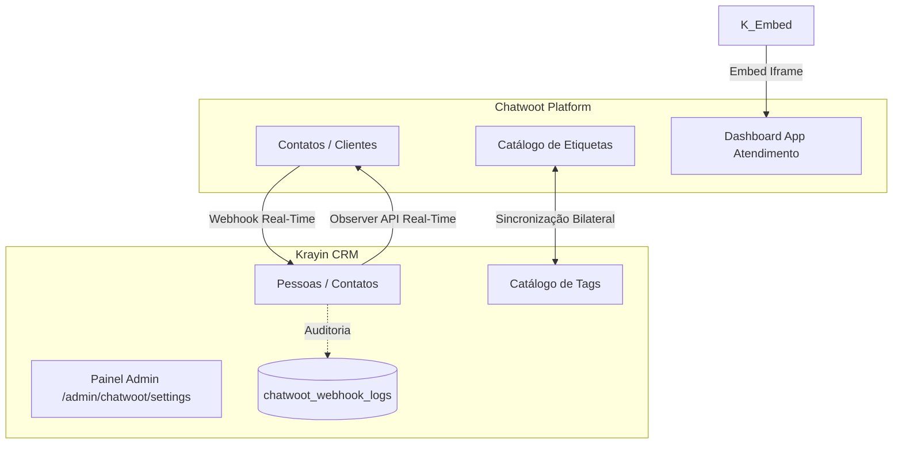

# Krayin CRM — Integração com Chatwoot e Relatórios

[](https://opensource.org/licenses/MIT)

Este repositório contém add-ons modulares de produção para o **[Krayin CRM](https://krayincrm.com)** com imagem oficial (`webkul/krayin:latest`):

- 💬 **`Webkul\Chatwoot`**: 
  - Integração de contatos e tags com o Chatwoot.
  - **Painel Administrativo no Menu Lateral** (`/admin/chatwoot/settings`) exclusivo para administradores com teste de conexão (Ping), sincronizador em massa e log de auditoria em tempo real.
  - **Dashboard App para Atendentes** (`/chatwoot/embed`) integrado à barra lateral do Chatwoot.
- 📊 **`Webkul\Reports`**:
  - Painel executivo de inteligência comercial (Visão Geral, Vendas & Receita, Funil Cônico com destaques para Ganho/Perdido, Desempenho por Tags e Produtividade por Atendente).

---

## 🏗️ Arquitetura dos Módulos



---

## ⚡ Evolução em especificação

O próximo ciclo, documentado no backlog Specsfy, estabelecerá o Chatwoot como
fonte de verdade para contatos e tags. A sincronização ocorrerá do Chatwoot
para o Krayin por webhooks e sincronização inicial confirmada por administrador.
O ciclo também prevê auditoria paginada, controles administrativos, suporte a
iframe com a sessão existente do Krayin e documentação white-label.
Ele não cria leads automaticamente; leads permanecem sob criação manual ou
por automações que utilizem a API do Krayin.

## 🧭 Desenvolvimento orientado por especificações

Este projeto utiliza Specsfy para registrar ideias, refiná-las em backlog e
transformá-las em especificações, testes e implementação rastreáveis. Ao final
de cada sprint, o próximo comando recomendado e uma mensagem de commit são
documentados no handoff.

Os addons são organizados como pacotes Laravel independentes em
`packages/Webkul/Chatwoot` e `packages/Webkul/Reports`.

## ⚡ Recursos atuais da integração

### API para automações (n8n)

Autentique cada chamada com `Authorization: Bearer <token>`. Os exemplos usam
domínios e dados fictícios.

Para chamadas do addon à API do Chatwoot, configure `CHATWOOT_API_TOKEN`.
`KRAYIN_API_TOKEN` continua destinado à autenticação das APIs expostas pelo
addon e não é usado para autenticar chamadas ao Chatwoot. Use
`Authorization: Bearer <token>` com o valor de `KRAYIN_API_TOKEN` nas APIs do
addon.

```http
GET https://crm.example.test/api/v1/contacts/persons?search=telefone-ou-email
Authorization: Bearer <token>
```

O retorno de contatos inclui `id`, `name`, `emails`, `contact_numbers`,
`job_title`, `user_id`, `organization_id`, `created_at` e `updated_at`.

```http
GET https://crm.example.test/api/v1/leads?person_id=<krayin_person_id>
Authorization: Bearer <token>
```

O segundo endpoint retorna somente os negócios vinculados ao contato informado.

```http
GET https://crm.example.test/api/v1/products?search=nome-ou-sku
Authorization: Bearer <token>
```

O retorno de produtos inclui `id`, `name`, `sku`, `description`, `quantity`,
`price`, `created_at` e `updated_at`.

Ao vincular ou atualizar um produto em um negócio por API, a resposta também
inclui `lead_value`. O valor da oportunidade é sempre a soma dos campos
`amount` dos produtos vinculados. A mesma regra é aplicada às alterações e
remoções feitas pela interface do Krayin.

Após atualizar o addon, execute as migrations do Krayin para instalar os
gatilhos de sincronização:

```bash
php artisan migrate --force
```

### 1. Sincronização de Contatos
- **Chatwoot ➔ Krayin**: Webhook escuta `contact_created`, `contact_updated` e `contact_deleted`.
- **Exclusão Segura**: Ao excluir um contato, os Negócios/Leads vinculados no Krayin são preservados com desvinculação (`person_id = null`), mantendo o faturamento e as métricas do funil intactos.

### 2. Catálogo Global de Tags
- O catálogo de tags do Krayin espelha com fidelidade as etiquetas ativas do Chatwoot (incluindo cores hexadecimais).
- Etiquetas recebidas do Chatwoot são associadas somente a pessoas/contatos; nunca são copiadas para negócios/leads.
- O comportamento de sincronização de tags é definido e evoluído pelo backlog Specsfy deste projeto.

### 3. Painel Administrativo Exclusivo (`/admin/chatwoot/settings`)
- Visível apenas para administradores via controle de acesso (ACL).
- **Testador de Ping**: Validação imediata de conectividade com a API do Chatwoot.
- **Sincronização sob Demanda**: Botão para alinhamento instantâneo do catálogo de tags e purga de tags obsoletas.
- **Log de Auditoria**: Tabela detalhada com as últimas requisições recebidas, status HTTP (200, 401, 500) e payloads.

---

## 🚀 Como Usar no Portainer / Docker Swarm

```yaml
version: "3.7"
services:

  ## --------------------------- INSTALADOR DE ADDONS (GITHUB) --------------------------- ##

  krayin_addons_installer:
    image: ghcr.io/lcastelar/krayincrm-chatwoot:latest
    command: sh -c "mkdir -p /target/Chatwoot /target/Reports && cp -rf /modules/Webkul/Chatwoot/* /target/Chatwoot/ && cp -rf /modules/Webkul/Reports/* /target/Reports/"
    volumes:
      - krayin_modules:/target
    deploy:
      restart_policy:
        condition: on-failure
        max_attempts: 2

  ## --------------------------- KRAYIN CRM (IMAGEM OFICIAL WEBKUL) --------------------------- ##

  krayin_app:
    image: webkul/krayin:latest

    volumes:
      - krayin_modules:/var/www/laravel-crm/packages/Webkul
      - /opt/krayin-AppServiceProvider.php:/var/www/laravel-crm/app/Providers/AppServiceProvider.php:ro
      - /opt/krayin-bootstrap-app.php:/var/www/laravel-crm/bootstrap/app.php:ro
      - /opt/krayin-nginx.conf:/etc/nginx/conf.d/krayin.conf:ro

    networks:
      - traefik_public
      - internal

    environment:
      APP_NAME: "Krayin CRM"
      APP_ENV: production
      APP_DEBUG: "false"
      APP_URL: https://crm.seu-dominio.com

      # Banco de dados
      DB_CONNECTION: mysql
      DB_HOST: krayin_db
      DB_PORT: 3306
      DB_DATABASE: krayincrm
      DB_USERNAME: root
      DB_PASSWORD: SUA_SENHA_DO_BANCO

      # Cache e Sessão
      CACHE_DRIVER: file
      SESSION_DRIVER: file

      # Integração Chatwoot
      CHATWOOT_URL: https://chat.seu-dominio.com
      CHATWOOT_API_TOKEN: SEU_CHATWOOT_API_ACCESS_TOKEN
      CHATWOOT_ACCOUNT_ID: 1
      CHATWOOT_WEBHOOK_SECRET: SEU_WEBHOOK_SECRET_OPCIONAL

    deploy:
      replicas: 1
      restart_policy:
        condition: any
      labels:
        - "traefik.enable=true"
        - "traefik.http.routers.krayin.rule=Host(`crm.seu-dominio.com`)"
        - "traefik.http.routers.krayin.entrypoints=websecure"
        - "traefik.http.routers.krayin.tls.certresolver=letsencrypt"
        - "traefik.http.services.krayin.loadbalancer.server.port=80"

volumes:
  krayin_modules:
  krayin_db_data:

networks:
  traefik_public:
    external: true
  internal:
    driver: overlay
```

---

### Encaminhamento do token Bearer pelo Nginx

Quando o Krayin estiver atrás de Nginx com PHP-FPM, inclua a diretiva abaixo
no bloco `location ~ \\.php$`, após `include fastcgi_params;`:

```nginx
fastcgi_param HTTP_AUTHORIZATION $http_authorization;
```

Sem essa diretiva, o PHP não recebe o cabeçalho `Authorization` e as rotas da
API retornam `401` mesmo quando o cliente envia um token Bearer válido.

Se esse arquivo Nginx for montado individualmente como bind mount no Docker
Swarm, uma edição que substitua o arquivo pode preservar a versão anterior no
container em execução. Após validar a sintaxe do Nginx, recrie somente o
serviço da aplicação para remontá-lo:

```bash
docker service update --force <stack>_krayin_app
```

---

## ⚙️ Configuração no Chatwoot

### 1. Configurar Webhook de Sincronização
1. No Chatwoot, vá em **Configurações ➔ Webhooks ➔ Adicionar novo webhook**.
2. **URL do Webhook**: `https://crm.seu-dominio.com/api/chatwoot/webhook`
3. **Eventos a marcar**:
   - ☑️ `Contato criado (contact_created)`
   - ☑️ `Contato atualizado (contact_updated)` (inclui sincronização em tempo real de tags nos contatos)
   - ☑️ `Conversa Criada (conversation_created)` (opcional)
   - ☑️ `Conversa Atualizada (conversation_updated)` (opcional)
4. Salve para ativar a sincronização instantânea.

### 2. Configurar Dashboard App (Barra Lateral)
1. No Chatwoot, vá em **Configurações ➔ Aplicativos do Painel ➔ Adicionar novo aplicativo**.
2. **Nome**: `Krayin CRM`
3. **URL do Painel**: `https://crm.seu-dominio.com/chatwoot/embed`
4. Salve.

---

## 📄 Licença

Este projeto é open-source disponibilizado sob a licença [MIT](LICENSE).
