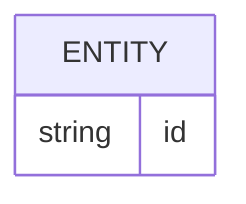

# Banco de dados

<!-- specsfy:documentator:start -->
## Fontes de persistência

| Arquivo |
| --- |
| packages\Webkul\Chatwoot\src\Database\Migrations\2026_08_27_000001_create_chatwoot_webhook_logs_table.php |
| Nenhuma estrutura confirmada além das fontes listadas. |

<!-- specsfy:documentator:end -->
